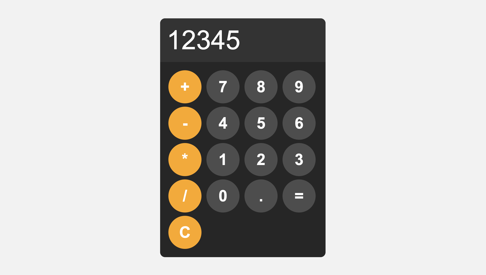

<h1>Calculator</h1>

Welcome to the Calculator repository! This simple yet powerful calculator is built using HTML, CSS, and JavaScript. It provides basic arithmetic operations in a user-friendly interface.

<h1>Features</h1>

Addition, subtraction, multiplication, and division functionality.
Clear and concise design for easy usability.
Responsive layout for seamless use on various devices.

<h1>Technologies Used</h1>

* HTML
* CSS
* JS

<h1>Preview</h1>

<h1>Usage</h1>

To view the cloned Amazon index webpage:
* Clone this repository to your local machine using git clone https://github.com/Suyash-Dhakal/Calculator.git
* Open index.html in your preferred web browser.

Feel free to explore the code and customize it according to your preferences. If you encounter any issues or have suggestions, don't hesitate to open an issue.

Happy calculating! 🧮